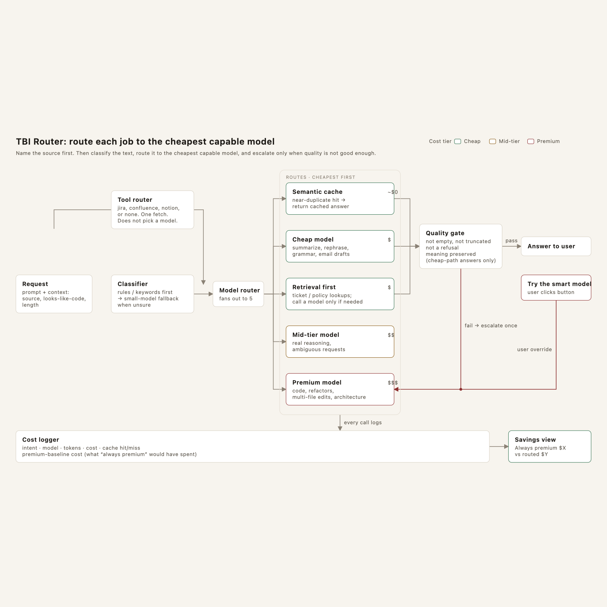
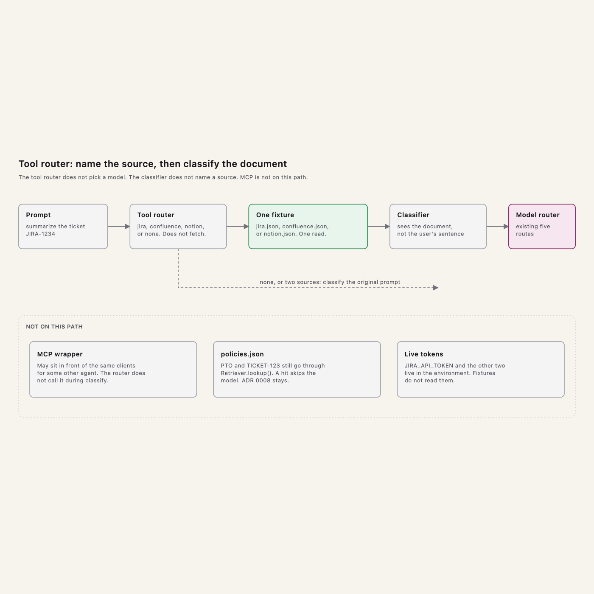
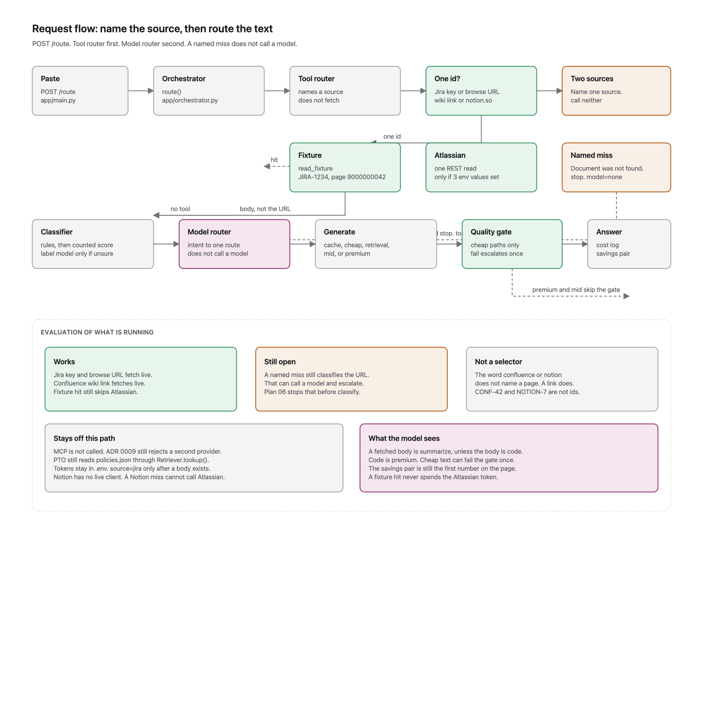
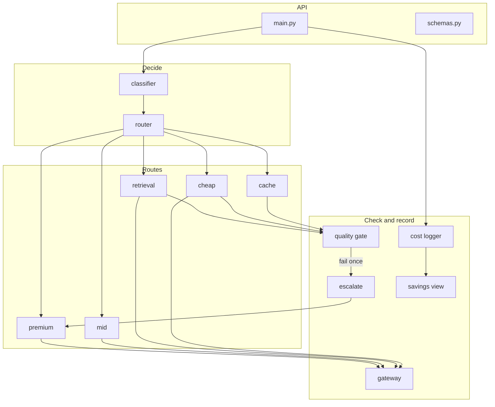

# Architecture

The request path is the diagram. The module boundaries are the plan. Decisions are the ADRs.

## Diagrams

| Artifact | Use it for |
|---|---|
| [tbi-router-diagram.html](tbi-router-diagram.html) | Source SVG of the model path. Open in a browser. Dark and light follow the page theme |
| [tbi-router-architecture.png](tbi-router-architecture.png) | Static export of the model path, for slides and PRs |
| [tool-router-diagram.html](tool-router-diagram.html) | Source SVG of the named-source path. Does not replace the model-path diagram |
| [tool-router-architecture.png](tool-router-architecture.png) | Static export of the tool-router path |
| [request-flow-diagram.html](request-flow-diagram.html) | Current request flow, including the live Atlassian read and the miss that still classifies |
| [request-flow-architecture.png](request-flow-architecture.png) | Static export of that flow |
| [Module map](#module-map) below | What each box owns, and what it must not own |

## Named-source path

Shipped after the model path. [ADR 0012](../adr/0012-tool-router-names-the-source.md). The tool router runs before classify because classify names a job, not a source. A miss or two matches stop. They do not classify the original prompt.

## Current request flow

What is running after the live Atlassian read. A Jira key and a Confluence wiki link fetch a body, then the model router sees that body. A named miss stops with no model call. See [Plan 06](../plans/06-named-source-miss.md).

## Request path

1. **Request** — prompt plus context: source, looks-like-code, length.
2. **Classifier** — rules and keywords first, small-model fallback when unsure. See [ADR 0002](../adr/0002-rules-first-classifier.md).
3. **Router** — fans out to one of five routes, cheapest capable first. See [ADR 0003](../adr/0003-five-routes-cheapest-first.md).
4. **Route** — semantic cache, cheap model, retrieval first, mid-tier, or premium.
5. **Quality gate** — cheap-path answers only. Pass goes to the user. Fail escalates once to premium. See [ADR 0004](../adr/0004-quality-gate-escalate-once.md).
6. **Try the smart model** — user override. Joins the premium path. Not a second classification.
7. **Cost logger** — every terminal call. Intent, model, tokens, cost, cache hit/miss, premium baseline. See [ADR 0006](../adr/0006-cost-baseline-without-premium-call.md).
8. **Savings view** — always premium $X vs routed $Y.

### What skips the quality gate

| Route | Gate | Why |
|---|---|---|
| Semantic cache | Yes | A bad cached answer must not bypass the check |
| Cheap model | Yes | This is the path the gate exists for |
| Retrieval first | Yes, on model-written text | A fixture hit checks non-empty only |
| Mid-tier | No | Not a cheap path. Escalating by default burns the savings |
| Premium | No | Already the top. A gate here would loop |
| User override | No | The user asked for this answer |

Escalate target is always premium. One hop. Never cheap → mid → premium on the same request.

## Module map

Call direction is one way. Route modules do not import each other. The gate does not import the router. The logger does not pick routes. Only `gateway.py` talks to a provider.

| Module | Owns | Must not own | ADR |
|---|---|---|---|
| `schemas.py` | Request, response, log row | Routing, pricing math | — |
| `classifier/` | Rules, unsure threshold, fallback prompt | Model selection, cache, cost | [0002](../adr/0002-rules-first-classifier.md) |
| `router/` | Intent → route table | HTTP, model calls, quality | [0003](../adr/0003-five-routes-cheapest-first.md) |
| `routes/cache.py` | Keying, similarity, TTL | Generation, quality judgment | [0005](../adr/0005-semantic-cache-cheap-intents.md) |
| `routes/cheap.py` | Task templates for language chores | Policy, pricing, gate | [0003](../adr/0003-five-routes-cheapest-first.md) |
| `routes/retrieval.py` | Lookup interface for `policies.json`. A hit skips the model | Jira, Confluence, or Notion. Those are fixtures behind the tool router | [0008](../adr/0008-optional-mid-tier-and-retrieval-stub.md) |
| `app/tools/` | Which source, if any. One fixture read | A model call, a route, classify, an MCP server | [0012](../adr/0012-tool-router-names-the-source.md) |
| `routes/mid.py` | Mid alias, or the cheap stub flag | Escalation policy | [0008](../adr/0008-optional-mid-tier-and-retrieval-stub.md) |
| `routes/premium.py` | Premium prompt passthrough | The decision to escalate | [0004](../adr/0004-quality-gate-escalate-once.md) |
| `gateway.py` | Timeouts, one retry, usage parsing | Intent, cache, quality | [0007](../adr/0007-hackathon-stack.md) |
| `quality/` | Four checks and thresholds | The escalate call, logging | [0004](../adr/0004-quality-gate-escalate-once.md) |
| `escalate.py` | Once-only rule, keyed by request id | Quality checks, UI | [0004](../adr/0004-quality-gate-escalate-once.md) |
| `cost/logger.py` | Row schema, baseline math | Display, routing | [0006](../adr/0006-cost-baseline-without-premium-call.md) |
| `cost/savings.py` | $X vs $Y, route mix | Per-request routing | [0006](../adr/0006-cost-baseline-without-premium-call.md) |
| `eval/` | Labeled prompts, replay, accuracy report | Serving | [0001](../adr/0001-decision-layer-not-a-chatbot.md) |

Layout and day-by-day ownership: [implementation plan](../plans/01-implementation-plan.md).
