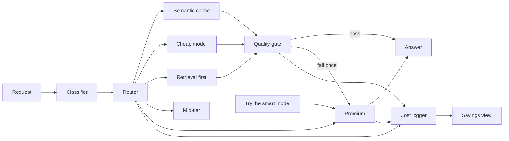

# TBI Router — implementation plan

Hand this to the builder. One service, one page, one eval set. No pitch.

**Goal.** Classify each request, send it to the cheapest path that can do the job, cache near-duplicates, log actual cost against an always-premium baseline, and escalate once when a cheap answer is not good enough.

Sources, in order: the [architecture diagram](../architecture/tbi-router-diagram.html) owns the request path, the [solution write-up](00-solution-writeup.md) owns scope, the [ADRs](../adr/README.md) own decisions already made.

## 1. Goal and non-goals

### In scope this week

| Item | Ship |
|---|---|
| One FastAPI service | `POST /route`, `POST /route/{id}/escalate`, `GET /savings`, `GET /logs` |
| Classifier | Rules and keywords first. One cheap-model label call only when rules are unsure |
| Five route slots | Cache, cheap model, retrieval-first, mid-tier, premium. Mid-tier and retrieval may be stubs ([ADR 0008](../adr/0008-optional-mid-tier-and-retrieval-stub.md)) |
| Quality gate | Cheap-path answers only. Fail escalates once |
| User override | "Try the smart model" on the answer already shown |
| Semantic cache | Cheap, repeat-heavy intents only |
| Cost logger + savings view | Every call logged. Page leads with always-premium $X vs routed $Y |
| Eval set | 40–60 real prompts, hand-labeled, replayed Friday |
| UI | One paste box + answer + dollars + savings strip. Streamlit or one HTML page |

Two live models are enough: one cheap, one premium. A third mid-tier model is optional, not a demo blocker.

### Out of scope

- Replacing GitHub Copilot. An editor command that posts a selection to `POST /route` shipped later. See [ADR 0011](../adr/0011-ide-command-calls-the-router.md). It does not pick a model.
- A new chatbot, chat history, or multi-turn memory
- Company SSO, per-team budgets, org-wide policy admin
- Fine-tuning or training a classifier
- A multi-team model gateway (use LiteLLM or OpenRouter as a client, do not build one)
- Security hardening as the product
- A second escalate, a frontier model inside the quality gate, human review sampling

Production note, not this week: the router later sits as a proxy in front of Slack, email, and docs. Copilot stays in the IDE. Do not build that proxy. A named-source fixture fetch for Jira, Confluence, and Notion shipped after this plan. See [ADR 0012](../adr/0012-tool-router-names-the-source.md). It is not a Jira proxy. [ADR 0001](../adr/0001-decision-layer-not-a-chatbot.md) still bans a chatbot inside those tools.

## 2. Request path



The same path as a static picture: [tbi-router-architecture.png](../architecture/tbi-router-architecture.png).

Numbered path for one `POST /route`:

1. **Request** arrives: `prompt`, optional `source`, `looks_like_code`, `length` (server fills the last two if the client omits them), optional `force_premium`.
2. **Classifier** returns an intent, a confidence, and `method` (`rules` or `small_model`). It does not call a generation model and does not pick a vendor model id.
3. **Router** maps intent → route. It does not call models. It does not score quality.
4. **One route runs.**
   - Cache hit on a cacheable intent: return the stored answer. Cost ≈ $0. Still goes to the quality gate (a bad cached answer must not bypass the check).
   - Cache miss: fall through to the route's generator (cheap model, retrieval, mid-tier, or premium).
5. **Quality gate** runs only for cheap-path answers (cache, cheap model, retrieval-first). Pass → step 7. Fail → step 6.
6. **Escalate once** to premium with the same prompt. Log `escalated=true` and the gate failure reason. Do not run the gate again. Do not escalate a second time.
7. **Answer** returned with route, model, tokens, cost, baseline cost, cache flag, and `can_escalate`.
8. **Every terminal call writes one cost-log row** before the response is returned. Logger failure must not hide the answer; it must surface in the savings view as a logger error, not a silent gap.
9. **Try the smart model** is a second request, `POST /route/{id}/escalate`. It joins the premium path. It is not a new classification. It is refused if this request already escalated.

### What skips the quality gate

| Route | Gate? | Why |
|---|---|---|
| Semantic cache | Yes | Cheap path. A poisoned or stale hit must not skip the check |
| Cheap model | Yes | This is the path the gate exists for |
| Retrieval first | Yes, on any model-written text | Extracted ticket/policy text with no model call still checks non-empty. Meaning-preserved is N/A |
| Mid-tier | No | Not a cheap path. Escalating mid → premium by default burns the savings the demo is here to show. Ambiguous requests already landed here because cheap was the wrong bet |
| Premium | No | Already the top. Nothing to escalate to. Gate-on-premium would loop |
| User override → premium | No | User asked for this answer. Show it |

Escalate target is always premium, including when mid-tier is wired. One hop. Never cheap → mid → premium in the same request. Decision: [ADR 0004](../adr/0004-quality-gate-escalate-once.md).

## 3. Module plan

Suggested layout. Names are the contract; move files if needed, do not merge responsibilities.

```text
app/
  main.py                 # FastAPI app, routes only
  schemas.py              # request / response / log row
  config.py               # model ids, prices, thresholds
  classifier/
    rules.py              # keyword and regex labels
    fallback.py           # cheap-model label call
    service.py            # rules first, fallback if unsure
  router/
    policy.py             # intent → route table
    service.py            # fan-out, no model calls
  routes/
    cache.py
    cheap.py
    retrieval.py
    mid.py
    premium.py
  gateway.py              # only module that calls LiteLLM / OpenRouter
  quality/
    gate.py
    meaning.py            # overlap check, no frontier model
  escalate.py
  cost/
    prices.py
    logger.py
    savings.py
  eval/
    prompts.jsonl
    replay.py
ui/
  app.py                  # Streamlit, or a single HTML page
```

Call direction is one way: `main` → classifier → router → one route module → gateway (if a model is needed) → quality gate → logger. Route modules do not import each other. The gate does not import the router. The logger does not decide routes.

### 3.1 Request schema — `app/schemas.py`

| | |
|---|---|
| Responsibility | Typed request, response, and log row. Shared by API, logger, and UI |
| Owns | Field names, enums, validation |
| Must not own | Classification, routing, pricing math |
| Inputs | Raw JSON |
| Outputs | `RouteRequest`, `RouteResponse`, `CostEvent` |
| Dependencies | None |
| MVP | Fields in §7. Reject empty prompt. Cap prompt length (8k chars is enough for the demo) |
| Later | Auth context, team id, multi-turn thread id |

Server-derived, not trusted from the client: `request_id`, `length`, `looks_like_code` (override only if the client sends it — the eval harness will), `created_at`.

### 3.2 Classifier — `app/classifier/`

| | |
|---|---|
| Responsibility | Map prompt + context to one intent and a confidence |
| Owns | Rule list, priority when two rules match, the "unsure" threshold, the fallback prompt |
| Must not own | Model selection, cache lookup, quality, cost |
| Inputs | `prompt`, `source`, `looks_like_code`, `length` |
| Outputs | `intent`, `confidence` (0–1), `method` (`rules` \| `small_model`), `matched_rule` or null |
| Dependencies | Gateway, only for the fallback call |
| MVP | Rules in §4. First match wins, top to bottom as listed. If no rule fires, or two rules of equal priority fire, call the cheap model once with a closed label set. If that call fails or returns an unknown label, intent = `ambiguous` |
| Later | Learned ranker. Not this week |

Rules:

- Code-looking context (`looks_like_code=true`, or fenced code longer than ~20 lines, or keywords `refactor`, `debug`, `stack trace`, `compile error`) outranks a soft word like "summarize this function" — that is still a code job. A one-line snippet inside an email rewrite stays `email_rewrite`.
- Do not send the fallback the full prompt if it is huge. Send the first ~1500 chars plus the context flags.
- Fallback must return one label from the catalog. Temperature 0. No free-text intent.

Decision: [ADR 0002](../adr/0002-rules-first-classifier.md).

### 3.3 Router — `app/router/`

| | |
|---|---|
| Responsibility | Intent → route id. Apply `force_premium` |
| Owns | The policy table. Nothing else |
| Must not own | HTTP, model calls, cache storage, quality checks |
| Inputs | Classifier result, `force_premium` |
| Outputs | `route` (`cache` \| `cheap` \| `retrieval` \| `mid` \| `premium`), `cacheable` bool |
| Dependencies | Policy table only |
| MVP | Static dict from §4. `force_premium=true` skips cache and cheap paths and sets route to `premium` |
| Later | Per-team policy, budget caps. Out of scope |

Cache is not a separate intent. The router marks cacheable intents; the cache module decides hit or miss, then the cheap (or retrieval) generator runs on miss.

Decision: [ADR 0003](../adr/0003-five-routes-cheapest-first.md).

### 3.4 Semantic cache — `app/routes/cache.py`

| | |
|---|---|
| Responsibility | Return a prior answer when the new prompt is a near-duplicate of a cacheable intent |
| Owns | Keying, similarity threshold, TTL, stored answer payload |
| Must not own | Generation, quality judgment, logging |
| Inputs | Normalized prompt, intent |
| Outputs | Hit: stored answer, token counts from the original call, `cache_hit=true`. Miss: `cache_hit=false` |
| Dependencies | None on the hot path. Optional embedding call through the gateway if you use embeddings |
| MVP | Cache only `summarize`, `rephrase`, `email_rewrite`, `grammar`. Do not cache `code`, `lookup`, `ambiguous`, `reasoning` |
| Later | Shared org cache, invalidation by source system |

MVP cache, in this order — stop at the first that works on the eval set:

1. **Normalized exact key.** Lowercase, collapse whitespace, strip greetings ("hi", "thanks", "please"). Same intent required. This catches the "same ticket pasted twice" case.
2. **Token overlap.** Jaccard on word shingles (size 3) ≥ 0.85, same intent, stored answer younger than 7 days. This is the semantic stand-in. Do not block the demo on an embedding provider.
3. **Optional:** embedding cosine ≥ 0.92 via a cheap embedding model through the gateway. Only if 1–2 miss obvious repeats in the eval set.

On hit, the stored answer still passes through the quality gate. On gate pass, do not write a new cache row. On gate fail, do not serve that row again — delete it, then escalate.

Cache stores: `intent`, normalized prompt, answer text, original model, original token counts. It does not store the premium baseline; the logger recomputes that.

Decision: [ADR 0005](../adr/0005-semantic-cache-cheap-intents.md).

### 3.5 Cheap model — `app/routes/cheap.py`

| | |
|---|---|
| Responsibility | Generate for language chores: summarize, rephrase, grammar, email drafts |
| Owns | The task prompt template per intent (short, fixed) |
| Must not own | Routing policy, pricing, gate logic |
| Inputs | Prompt, intent |
| Outputs | Answer text, model id, token usage |
| Dependencies | Gateway |
| MVP | One cheap model id in config. One template per cacheable intent. Max output tokens capped (512 for the demo) so truncation is rare and, when it happens, the gate can see it |
| Later | Template library, style memory. Not this week |

### 3.6 Retrieval first — `app/routes/retrieval.py`

| | |
|---|---|
| Responsibility | Answer lookups from a source before calling a model |
| Owns | The lookup interface and the "model only if needed" rule |
| Must not own | A Jira, Confluence, or Notion client. Named-source fixtures live in `app/tools/`, not here. See [ADR 0012](../adr/0012-tool-router-names-the-source.md) |
| Inputs | Prompt, intent `lookup` |
| Outputs | Either an extracted answer with `model_called=false`, or a cheap-model answer grounded in the stub text |
| Dependencies | Gateway only if the stub misses |
| MVP stub | A JSON file, `eval/fixtures/policies.json`, with 8–15 fake tickets and policy blurbs keyed by id (`TICKET-123`, `PTO`, `VPN`). If the prompt mentions a known id or title, return that text and skip the model. If not, call the cheap model with the prompt and set `retrieval_miss=true`. Do not invent a search stack |
| Later | Live Jira / policy search. The interface stays `lookup(query) -> hit | miss` |

This route is cheap-tier. A model-written answer goes through the quality gate. A direct fixture hit checks non-empty only.

Decision: [ADR 0008](../adr/0008-optional-mid-tier-and-retrieval-stub.md).

### 3.7 Mid-tier — `app/routes/mid.py`

| | |
|---|---|
| Responsibility | Real reasoning and ambiguous requests, when a mid model exists |
| Owns | Nothing in the MVP if the model is not configured |
| Must not own | Escalation policy |
| Inputs | Prompt, intent `reasoning` or `ambiguous` |
| Outputs | Answer, or a redirect to another route |
| Dependencies | Gateway, if enabled |
| MVP stub | If `MID_MODEL` is unset, map `reasoning` and `ambiguous` to the **cheap** model and set `used_mid_stub=true` on the log. The UI should show the route as `cheap (mid unavailable)`, not pretend it was mid-tier. Do not silently send these to premium — that destroys the savings number |
| Later | A real mid model. Flip the config. No code change in the router |

Skip the quality gate on a real mid-tier response. The stub is a cheap model, so the gate **does** run when `used_mid_stub=true`.

Decision: [ADR 0008](../adr/0008-optional-mid-tier-and-retrieval-stub.md).

### 3.8 Premium — `app/routes/premium.py`

| | |
|---|---|
| Responsibility | Code, refactors, multi-file edits, architecture, plus any escalated or overridden request |
| Owns | The premium prompt wrapper (pass the user prompt through; do not "helpfully" shrink it) |
| Must not own | The decision to escalate. That lives in `escalate.py` |
| Inputs | Prompt, reason (`route` \| `quality_fail` \| `user_override`) |
| Outputs | Answer, model id, token usage |
| Dependencies | Gateway |
| MVP | One premium model id. No gate after this call |
| Later | Tool use, repo context. Out of scope. Copilot keeps code in the IDE |

### 3.9 Model gateway — `app/gateway.py`

| | |
|---|---|
| Responsibility | The only place that talks to LiteLLM or OpenRouter |
| Owns | Timeouts, one retry on 429/5xx, usage parsing, model-id config |
| Must not own | Intent logic, cache, what to do on a bad answer |
| Inputs | `model_alias` (`cheap` \| `premium` \| `mid` \| `embed`), messages, max tokens |
| Outputs | Text, `prompt_tokens`, `completion_tokens`, `model_id`, latency. Raise a typed `GatewayError` on failure |
| Dependencies | Provider SDK and env keys |
| MVP | Aliases in `config.py`, not scattered strings. 30s timeout. One retry. If the cheap alias fails, the route returns an error to the orchestrator, which escalates once to premium and logs `gateway_failover=true`. If premium fails, return the error to the user. Do not retry premium into itself |
| Later | Key rotation, fallback vendors. Not this week |

Pricing does not live here. The gateway returns tokens. `cost/prices.py` turns tokens into dollars.

Decision: [ADR 0007](../adr/0007-hackathon-stack.md).

### 3.10 Quality gate — `app/quality/gate.py`

Specified in §5. Module rules only:

| | |
|---|---|
| Responsibility | Pass or fail a cheap-path answer. Return a reason code |
| Owns | The four checks and their thresholds |
| Must not own | The escalate call, the user-facing copy, logging |
| Inputs | Prompt, intent, answer text, `finish_reason` if the gateway has it |
| Outputs | `pass` or `fail` plus `reason` (`empty` \| `truncated` \| `refusal` \| `meaning` \| `too_short`) |
| Dependencies | `meaning.py`. No gateway call |
| MVP | Deterministic checks only |
| Later | A small human-rated sample. Not a second model on the hot path |

### 3.11 Escalation and user override — `app/escalate.py`

| | |
|---|---|
| Responsibility | Send a request to premium exactly once, whether the gate failed or the user clicked |
| Owns | The once-only rule, keyed by `request_id` |
| Must not own | Quality checks, UI |
| Inputs | Original request id, prompt, reason |
| Outputs | Premium answer, linked to the same request id |
| Dependencies | Premium route, logger |
| MVP | In-memory set of escalated ids is fine for the demo. Persist the flag on the log row so a restart does not allow a second click to double-charge without a trace |
| Later | Durable store. Same rule |

If the user clicks override on a request that already failed the gate and escalated, return the existing premium answer. Do not call premium again.

### 3.12 Cost logger — `app/cost/logger.py`

| | |
|---|---|
| Responsibility | Append one row per terminal outcome. Compute premium baseline |
| Owns | The row schema, the file or SQLite table, baseline math |
| Must not own | Display, routing |
| Inputs | A `CostEvent` from the orchestrator |
| Outputs | A stored row. `GET /logs` reads it back |
| Dependencies | `prices.py` |
| MVP | SQLite, one table, one row per request. Rewrite the row in place on escalate (keep `first_route` and `first_cost`, add premium tokens). Baseline is always computed, including on cache hits |
| Later | Warehouse export. Not this week |

Baseline rule: `baseline_cost = price(premium, prompt_tokens of this request, estimated completion)`. For a cache hit or cheap call you do not have premium completion tokens. Estimate them as the cheap completion tokens, or as `max(cheap_completion_tokens, 0.5 * prompt_tokens)` — pick one, write it in `prices.py`, and use it everywhere including the replay. Do not mix formulas. The savings number is only honest if the formula is stable.

Do not call the premium model just to learn the baseline. That would erase the savings.

Decision: [ADR 0006](../adr/0006-cost-baseline-without-premium-call.md).

### 3.13 Savings view — `app/cost/savings.py` + UI

| | |
|---|---|
| Responsibility | Aggregate the log into the two numbers and the table the page renders |
| Owns | Sums, percents, filters |
| Must not own | Per-request routing |
| Inputs | Log rows |
| Outputs | Totals in §6 |
| Dependencies | Logger |
| MVP | Aggregate over the current log. A "replay eval set" button writes rows with `source=eval` so the demo total is the labeled set, not whatever a judge just pasted |
| Later | Per-team budgets. Out of scope |

### 3.14 Eval set — `app/eval/`

| | |
|---|---|
| Responsibility | The labeled set the week is judged on |
| Owns | `prompts.jsonl`, the replay script, the accuracy report |
| Must not own | Production serving |
| Inputs | Hand-labeled prompts |
| Outputs | Classification accuracy, route mix, $X vs $Y, list of misses |
| Dependencies | The API, or the orchestrator called in-process |
| MVP | 40–60 rows. Schema below. Replay is idempotent and tagged `source=eval` |
| Later | A standing nightly replay. Not this week |

```text
{"id": "p01", "prompt": "...", "source": "slack|jira|email|ide|docs",
 "intent": "summarize", "notes": "should stay cheap"}
```

Day 1 writes this file. Day 2 refuses to add features until rules hit the obvious rows. Friday's demo replays this file, not invented examples.

## 4. Intent catalog

Priority is top to bottom. First matching rule wins. `code` is first so a coding prompt that also says "summarize" does not go cheap.

| Intent | Example phrases | Default route | Cacheable | Quality gate |
|---|---|---|---|---|
| `code` | "write a function", "refactor this", "debug", "this stack trace", "multi-file", "architecture of this service" | premium | No | No |
| `lookup` | "what's our PTO policy", "status of TICKET-123", "what does the VPN doc say" | retrieval, then cheap model only on miss | No | Yes if a model wrote the text. Non-empty only on a fixture hit |
| `summarize` | "summarize", "tl;dr", "bullet these notes", "make this shorter" | cache, else cheap | Yes | Yes, including meaning |
| `email_rewrite` | "rewrite this email", "sound more professional", "draft a reply" | cache, else cheap | Yes | Yes, including meaning |
| `rephrase` | "rephrase", "say this differently" | cache, else cheap | Yes | Yes, including meaning |
| `grammar` | "fix grammar", "proofread", "clean this up" | cache, else cheap | Yes | Yes. Meaning check is lighter — see §5 |
| `reasoning` | "why did this fail", "compare these options", "what should we do" | mid, or cheap stub if mid is unset | No | Only when served by the cheap stub |
| `ambiguous` | no rule matched, or rules tied, or fallback failed | mid, or cheap stub if mid is unset | No | Only when served by the cheap stub |

Closed set. The fallback model may only emit one of these eight labels. Unknown label → `ambiguous`.

Context flags adjust, they do not add intents:

- `source=ide` plus `looks_like_code` → `code`, unless the prompt is clearly an email or grammar fix with a short snippet.
- `length` under ~20 chars and no rule hit → `ambiguous`, do not spend a fallback call.

## 5. Quality gate

Runs on cheap-path answers only. See §2 for what that includes. No gateway call. No frontier model. Decision: [ADR 0004](../adr/0004-quality-gate-escalate-once.md).

Checks, in order. First failure wins.

| Check | Fail when | Pass when |
|---|---|---|
| Empty | Answer is empty or whitespace | Any non-whitespace text |
| Truncated | Gateway `finish_reason=length`, or the answer ends mid-token (no sentence-ending punctuation and length ≥ 90% of `max_tokens`) | Normal finish, or a short complete answer |
| Refusal | Starts with or contains a refusal cue: "as an AI", "I can't help", "I cannot assist", "I'm sorry, but I can't", empty apology with no rewrite | The answer does the task |
| Too short | Summarize / email / rephrase output under 15 chars, or under 10% of source length when source is over 200 chars | Inside that band |
| Meaning preserved | Only for `summarize`, `email_rewrite`, `rephrase`, `grammar`. See below | Overlap holds |

**Meaning preserved**, without another generation call:

- Tokenize source and answer: lowercase, drop stopwords, keep numbers, ticket ids, names, and money amounts.
- `summarize`: at least 40% of answer content-words appear in the source, and every number / id / money amount in the answer appears in the source. Summaries may be shorter. Do not require the reverse overlap.
- `rephrase` and `email_rewrite`: content-word Jaccard between source and answer ≥ 0.35, and every number, email address, date, and ticket id in the source appears in the answer. Rewording is allowed. Dropping a date or a dollar figure is not.
- `grammar`: same entity check (numbers, ids, emails must survive). Skip the Jaccard floor — a grammar fix can be almost identical, and a low bar here only creates false fails.

These thresholds are starting points. Day 6 may move them if the eval set shows false fails. Write the values in `config.py`, not in the check functions.

**Pass.** Return the cheap answer. `can_escalate=true` so the UI can still offer the button.

**Fail.** Call escalate once with `reason=quality_fail`. Show the premium answer. Set `can_escalate=false`. Do not run the gate on the premium answer. If premium itself is empty or a gateway error, show the error and the cheap answer underneath, labeled as failed quality. Still do not call premium a second time.

Never escalate twice. The orchestrator holds a flag on the request before the premium call starts, so a timeout cannot double-fire.

## 6. Cost logger and savings view

### Log row

One row per request. Updated in place if that request escalates.

| Field | Meaning |
|---|---|
| `request_id` | Server-generated. Also the escalate key |
| `timestamp` | UTC ISO-8601 |
| `source` | `ui`, `eval`, or the client source |
| `intent` | Catalog label |
| `classifier_method` | `rules` or `small_model` |
| `route` | Final route that produced the shown answer |
| `first_route` | Route before any escalate. Equals `route` if none |
| `model` | Model id that produced the shown answer. `cache` if hit and no escalate |
| `prompt_tokens`, `completion_tokens` | For the shown answer. Cache hit copies the original generation's counts, cost stays 0 |
| `cost_usd` | What we actually spent, including the cheap call **plus** premium if we escalated. Cache hit = 0 |
| `cache_hit` | true / false |
| `baseline_cost_usd` | Always-premium estimate. Formula in §3.12, one formula only |
| `escalated` | true if gate fail or user override |
| `escalate_reason` | `quality_fail` \| `user_override` \| null. Include the gate reason code |
| `saved_usd` | `baseline_cost_usd - cost_usd`. Can be negative if we escalated and the cheap call was wasted. Show the negative. Do not clip it |

Index `timestamp` and `source`. The demo filter is `source=eval`.

### What the judge sees first

One strip, above the paste box, readable in under 10 seconds:

```text
Always premium   $X.XX
Routed           $Y.YY
Saved            $Z.ZZ   (P%)
```

Under it, one line of mix, not a chart library: `42 requests · 31 cheap · 6 cache · 4 premium · 1 escalated`.

Then the paste box and the answer. The per-request table is below the fold, newest first. Columns: time, intent, route, model, cache, escalated, cost, baseline, saved. Money is `$0.0042`, four decimals, so cheap calls do not all look like `$0.00`.

Color is the diagram's, and it is not the only signal: cheap green, mid amber, premium magenta, plus a text label on every row. Escalate rows show both hops: `cheap → premium`.

### States

| State | What the page shows |
|---|---|
| Empty | The $X / $Y strip shows `$0.00` / `$0.00` / `$0.00`. Table says "No requests yet. Paste a prompt or replay the eval set." Do not hide the strip |
| Loading | Paste is disabled. Answer pane says "Routing…". Strip does not flicker to zero |
| Answer ready | Intent, route, model, this-call cost, this-call baseline, cache hit or miss, answer text. Button "Try the smart model" only if `can_escalate=true` |
| Escalate loading | Button becomes "Asking the premium model…". Do not clear the cheap answer until the premium text arrives |
| Error | Red line with the gateway or validation message. Strip unchanged. No fake $0 savings row |
| Logger error | Answer still shown. A small line: "This call was not logged — savings total may be short." |

No settings panel. No model picker for the user. The only user controls are the paste box, Submit, Try the smart model, and Replay eval set.

## 7. API contract

### `POST /route`

Request:

```json
{
  "prompt": "rewrite this email: ...",
  "source": "email",
  "looks_like_code": false,
  "force_premium": false
}
```

`prompt` required, 1–8000 chars. `source` optional (`slack` \| `jira` \| `email` \| `ide` \| `docs` \| `ui` \| `eval`). Other fields optional.

Response `200`:

```json
{
  "request_id": "req_01h...",
  "intent": "email_rewrite",
  "classifier_method": "rules",
  "route": "cheap",
  "model": "gpt-4o-mini",
  "answer": "...",
  "cache_hit": false,
  "escalated": false,
  "escalate_reason": null,
  "can_escalate": true,
  "usage": { "prompt_tokens": 180, "completion_tokens": 90 },
  "cost_usd": 0.0004,
  "baseline_cost_usd": 0.0060,
  "saved_usd": 0.0056
}
```

`can_escalate` is the flag the UI binds to the button. It is `false` when the route is already premium, when this request already escalated, or when `force_premium` was set.

Errors: `400` empty prompt, `502` premium gateway failure after the one escalate (body includes `request_id` so the log row can be found).

### `POST /route/{request_id}/escalate`

No body. Loads the stored prompt, calls premium once, updates the log row, returns the same response shape with `escalated=true`, `escalate_reason=user_override`, `can_escalate=false`.

`404` unknown id. `409` already escalated — body includes the existing premium answer so the UI can show it instead of erroring.

### `GET /savings?source=eval`

```json
{
  "requests": 42,
  "always_premium_usd": 1.84,
  "routed_usd": 0.71,
  "saved_usd": 1.13,
  "saved_pct": 61.4,
  "by_route": { "cache": 6, "cheap": 31, "retrieval": 0, "mid": 0, "premium": 5 },
  "escalated": 1,
  "cache_hits": 6
}
```

### `GET /logs?source=eval&limit=50`

Array of log rows, newest first. This feeds the table. Do not make the UI recompute savings from the table.

## 8. Week plan and done criteria

Maps to the [write-up](00-solution-writeup.md). Do not pull later modules forward.

| Day | Build | Done when |
|---|---|---|
| 1 | Eval set, intent catalog, "good enough" notes for summary and email | 40–60 real prompts in `prompts.jsonl`, each with a hand label. No service code required |
| 2 | Classifier only | Rules + fallback measured against the labeled set. Obvious cases land. If they do not, fix rules and labels. Do not start the router |
| 3 | Router, gateway, cheap + premium routes, escalate-once, `POST /route` returning cost and baseline | A summarize goes cheap, a code prompt stays premium, a forced gate fail escalates once and not twice |
| 4 | Cache for the four cacheable intents. Logger and `GET /savings`. Replay harness | Replay prints $X vs $Y for the labeled set. Cache hit on a pasted duplicate costs $0 |
| 5 | UI: strip, paste box, answer, button, table. Ten side-by-side examples set aside (five cheap that look fine, a few code that stayed premium, one miss that escalated) | A person who did not write the code can run the page |
| 6 | Read accuracy, cheap-share, dollars, and the misses a judge would notice. Fix those misses only | Thresholds or rules adjusted. No new modules |
| 7 | No new scope | Live paste, savings number, one shown failure and the escalate path |

### Done

- Intent accuracy ≥ ~90% on the hand-labeled 40–60, measured by `eval/replay.py`, not by eye.
- Most non-code rows in that set never call premium. Code rows stay on premium.
- Cheap answers for summaries and emails are ones a person would send. The meaning check is the backstop, not the proof — read the ten side-by-side examples.
- One real miss is kept, escalated once, and visible in the table. Do not delete it to make the number prettier.
- The savings strip matches `GET /savings?source=eval`. If the page and the endpoint disagree, the endpoint wins and the page is wrong.

### Explicitly not done this week

Copilot replacement, SSO, fine-tuning, a real retrieval backend, a third live model (unless it is free to wire), a second quality model, per-team budgets.
