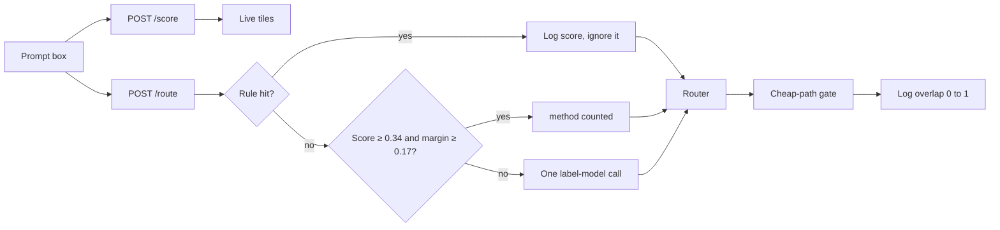

# Counted score — implementation plan

Hand this to the engineer who already shipped the rules classifier. This is the lite ML add-on, not a new router.

**Goal.** Score every prompt with a counted margin, show that score before and after submit, and let the margin pick an intent only when rules are unsure.

Sources: [ADR 0010](../adr/0010-counted-margin-not-a-fitted-model.md) owns the decision. [ADR 0002](../adr/0002-rules-first-classifier.md) still owns rules-first. [Design note](03-lite-ml-signals.md) owns the worked examples.

## 1. Goal and non-goals

### In scope

| Item | Ship |
|---|---|
| Counted intent margin | Hand token lists. Score = hits / list length. Margin = top − second |
| Decision order | Rules, then counted margin, then one small-model label call |
| Gate overlap number | Same count the pass/fail already uses. Logged. Thresholds do not move |
| Live score | `POST /score` while typing. No model call. No cost row |
| Answer metrics | Counted score, margin, overlap, why — next to model, cost, latency |
| Test | An obvious summarize prompt never calls the label model |

### Out of scope

- Training, fine-tuning, or fitting weights to `prompts.jsonl`
- A neural net, embeddings, or a vector store for this signal
- A second provider client
- Calling premium, mid, or cheap to judge quality
- Changing route table, savings math, or escalate-once
- Reporting accuracy. 40 rows cannot support that claim

## 2. Where it sits on the request path

The five routes do not change. The new step is inside the classifier, before the router.

1. **Box text** — `POST /score`. Rules and counted margin only. UI tiles update. No route, no log row.
2. **Submit** — `POST /route`. Classifier runs the same two checks, then the label model only if both miss.
3. **Router** — intent → one of five routes. Unchanged.
4. **Quality gate** — cheap paths only. Overlap is attached to the response when the gate runs. Premium and mid leave it blank.
5. **Answer** — show the cheap or escalated answer, plus the score tiles. Savings strip still reads `GET /savings`.

## 3. Module plan

### 3.1 `app/classifier/counted.py`

| | |
|---|---|
| Owns | Token lists, `score_intents`, `margin`, `confident`, floors 0.34 and 0.17 |
| Inputs | Prompt text |
| Outputs | Ranked `(intent, score)` and `(top intent, score, margin)` |
| Must not own | Rules, the label-model call, routing, cost |
| Key rule | Lists are hand-written. One shared word must not clear the margin alone |
| MVP | Seven intents. `ambiguous` is not scored |
| Later | A new token after a real miss. Not a refit |

### 3.2 `app/classifier/service.py`

| | |
|---|---|
| Owns | Order: rules, short-prompt stop, counted pick, one label call. `score_prompt()` for the box |
| Inputs | Prompt, optional source, optional looks-like-code |
| Outputs | `Classification` with `signal`, `signal_score`, `signal_margin`. `PromptScore` for the live tiles |
| Must not own | Vendor model ids, gateway retries, savings |
| Key rule | A rule hit sets method `rules` even when the counted score is high |
| MVP | `score_prompt` returns `unsure` when both miss. It does not call the model |
| Later | Nothing in this file until a new ADR supersedes 0002 |

### 3.3 `app/quality/meaning.py`

| | |
|---|---|
| Owns | `overlap_score`: summarize coverage, rewrite Jaccard, grammar entity keep-rate |
| Inputs | Intent, source text, answer text |
| Outputs | Float 0–1, or `None` when this intent has no meaning check |
| Must not own | Pass/fail floors, escalate, a model call |
| Key rule | `None` is not rounded. Do not invent 0 for lookup, code, or premium |
| MVP | Log only. Floors stay in config |
| Later | Do not add a model judge |

### 3.4 `app/orchestrator.py` and `app/schemas.py`

| | |
|---|---|
| Owns | Copy `signal`, `signal_score`, `signal_margin` onto the route response. Copy gate overlap only when the gate ran |
| Inputs | Classification and optional gate result |
| Outputs | Fields the answer pane reads |
| Must not own | Recomputing the score, changing baseline cost |
| Key rule | Savings math is untouched |

### 3.5 `POST /score` in `app/main.py`

| | |
|---|---|
| Owns | Validate the body, call `Classifier.score_prompt`, return `PromptScore` |
| Inputs | `{ "prompt": string }` |
| Outputs | `method`, `intent`, `signal`, `signal_score`, `margin`, top three `ranked` intents with score > 0 |
| Must not own | Routing, logging, the label model |
| Key rule | Under 8 characters returns `keep typing` and zeros. No gateway import on this path |

### 3.6 Dashboard

| | |
|---|---|
| Owns | Four live tiles and four answer facts |
| Live tiles | Method, Intent, Counted score, Margin. Note under them is the `signal` string |
| Answer facts | Counted score, Margin, Overlap, Why |
| Empty | Tiles show `—` until the first score returns |
| Loading | Previous tiles stay until the debounced score returns. Do not flash zeros |
| Error | Leave the last good tiles. Do not write a fake score |
| Must not own | Savings. The strip still calls `GET /savings` |

## 4. Decision table

| Prompt shape | Method | Label model | What the UI says |
|---|---|---|---|
| Rule hit, any counted score | `rules` | No | `rules would win: {intent} · counted {score} ignored` |
| Shorter than 20 characters on submit | `rules` | No | `rules: too short · no label-model call` |
| No rule, score ≥ 0.34 and margin ≥ 0.17 | `counted` | No | `counted: {intent} · margin {gap} · no label-model call` |
| No rule, margin too small | `small_model` | Once, on submit only | `small_model: {label} · counted margin {gap}` |
| Box text under 8 characters | `rules` | No | `keep typing` |

Worked counts, not measured accuracy:

- One token in the 5-token summarize list is 0.20. It does not clear 0.34.
- `shorter` and `skim` is 2/5 = 0.40, margin 0.40. That is a counted win if no rule hit.
- `What's the status of TICKET-123?` hits the lookup rule. Counted score 0.40 is shown and ignored.

## 5. API

### `POST /score`

Request: `{ "prompt": "What's the status of TICKET-123?" }`

Response fields the tiles read:

| Field | Example | Meaning |
|---|---|---|
| `method` | `rules` | `rules`, `counted`, or `unsure` |
| `intent` | `lookup` | Blank only while the box is too short to score |
| `signal_score` | `0.40` | Top counted score, even when ignored |
| `margin` | `0.40` | Top minus second |
| `signal` | `rules would win: lookup · counted 0.40 ignored` | The note under the tiles |
| `ranked` | `[{ "intent": "lookup", "score": 0.40 }]` | Up to three intents with score > 0 |

No `cost`, no `request_id`, no `cache_hit`. This call is not a route.

### `POST /route` additions

Existing cost, baseline, cache-hit, and escalate fields stay. Add:

| Field | When set |
|---|---|
| `signal` | Always, after classify |
| `signal_score` | Always. Rounded to 2 decimals |
| `signal_margin` | Always. Rounded to 2 decimals |
| `overlap_score` | Only when the cheap-path gate ran a meaning check. Otherwise null |

The UI "Try the smart model" flag is unchanged. A counted win does not hide it.

## 6. Done

- Obvious summarize prompt: method `rules`, gateway spy sees no label call.
- No-rule prompt that clears 0.34 / 0.17: method `counted`, no label call, margin in the log.
- `POST /score` on either prompt: no gateway call, no new cost row.
- Answer pane shows score, margin, and why. Overlap is null on premium and on intents with no meaning check.
- `GET /savings` still matches the strip after a submit.
- No train script. No new provider import.
